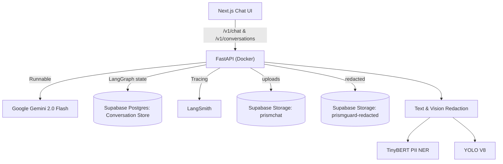

# Tiktok-Jampots

We are the Tiktok-Jampot and we have decided to tackle issues pertaining to Personally Identifiable Information pertaining to LLM-powered Applications. (Problem Statement 7) In this case, we decided to look at chatbots that send text or image prompts to external LLM APIs. Our solution is called PrismGuard.

# 🛡 PrismGuard
**Multi-Modal Privacy Firewall for the AI Era**

PrismGuard is a two-layer system that protects Personally Identifiable Information (PII) before it ever reaches an external AI service. 
Think of it as a **VPN for your prompts and images**: everything you send to an LLM or AI API first passes through PrismGuard, where sensitive details are detected, anonymized, and logged transparently.

⸻

# PrismChat + PrismGuard 🔒🤖

A **privacy-first conversational AI platform** combining a **Next.js chat frontend** with a **Dockerized FastAPI backend**. It integrates **LangChain/LangGraph** for reasoning and memory, **LangSmith** for tracing, and **Supabase** (Postgres + Storage) for persistence.  
When **PrismGuard** is enabled, we apply **PII redaction** for **text and images** before any request reaches the LLM.

---

## 🧭 Table of Contents

- [Overview](#-overview)
- [Architecture](#-architecture)
- [Features](#-features)
- [Tech Stack](#-tech-stack)
- [Environment Variables](#-environment-variables)
- [Local Development](#-local-development)
- [API Summary](#-api-summary)
- [Supabase Schema & Storage](#-supabase-schema--storage)
- [PrismGuard Models](#-prismguard-models)
- [How Redaction Works](#-how-redaction-works)
- [Example Flows](#-example-flows)
- [Roadmap](#-roadmap)
- [License](#-license)

---

## 🚀 Overview

**PrismChat** is a chat experience built with **Next.js** that talks to a **FastAPI** backend.  
The backend orchestrates a conversation pipeline (LangChain Runnable + LangGraph) with **Google Gemini 2.0 Flash**.  

**PrismGuard** is a privacy layer:
- **Text PII**: a fine-tuned **TinyBERT (4L-312D)** NER model trained on the **AI4Privacy** dataset detects PII and **redacts it** *before* calling Gemini.
- **Image PII**: a lightweight **vision pipeline** (OCR + OpenCV) blurs faces and sensitive text (e.g., IDs) and stores only **redacted** versions.

Everything is **traced** with **LangSmith** for observability.

---

## 🏗 Architecture



---

## ✨ Features

- **Chat UI (Next.js + Tailwind)**
  - Multimodal: send text and images.
  - Markdown rendering for AI replies.
  - Conversation list (sidebar) + timestamps.

- **FastAPI Backend**
  - `/v1/chat` accepts `{ conversation_id, text?, images?[], prismguard? }`.
  - Saves chat history to Postgres.
  - Generates signed URLs for redacted images stored in Supabase.

- **Reasoning & Memory**
  - **LangChain Runnable** for prompt assembly.
  - **LangGraph** for stateful control (entry → agent → END).
  - Pulls short/structured history from Supabase.

- **Privacy**
  - **Text PII** detection with **TinyBERT 4L-312D** (IOB: `O`, `B-PII`, `I-PII`).
  - **Image PII** redaction.
  - Optional **TFLite** export (< 40 MB) for on-device use.

- **Observability**
  - **LangSmith** tracing for every step.

---

## 🧰 Tech Stack

**Frontend**
- Next.js 14 (App Router), TypeScript
- Tailwind CSS
- `marked` + `DOMPurify` for safe Markdown rendering
- `next/image` (with remote patterns for Supabase)

**Backend**
- FastAPI (Uvicorn)
- LangChain, LangGraph
- LangSmith (tracing)
- Google Gemini (via `langchain-google-genai`)
- Supabase Python client (`storage` + Postgres via `psycopg2`)
- OpenCV, Tesseract (or compatible OCR) for image text detection

**Data**
- Supabase Postgres (chat history)
- Supabase Storage:
  - `prismchat/` (raw uploads if needed)
  - `prismguard-redacted/{conversation_id}/...` (blurred output)

**Models**
- **LLM**: Google **Gemini 2.0 Flash**
- **Text PII**: **TinyBERT (General 4L-312D)**, fine-tuned on **AI4Privacy PII-Masking**
- **Vision**: YOLO V8

---

## 🔧 Environment Variables

### Backend (`prismchatbackend/.env`)
```env
# Supabase
SUPABASE_URL=https://<project>.supabase.co
SUPABASE_SERVICE_KEY=<service_role_key>
PG_CONN_STR=postgresql://<user>:<pass>@<host>:5432/<db>

# LLMs & Tracing
GOOGLE_API_KEY=<gemini_api_key>
LANGCHAIN_TRACING_V2=true
LANGCHAIN_API_KEY=<langsmith_api_key>
LANGCHAIN_PROJECT=prismchat

# Storage
RAW_BUCKET=prismchat
RED_BUCKET=prismguard-redacted

# Misc
ENV=dev
```

### Frontend (`prismchatfrontend/.env.local`)
```env
NEXT_PUBLIC_API_BASE_URL=http://localhost:8000
NEXT_PUBLIC_SUPABASE_URL=https://<project>.supabase.co
NEXT_PUBLIC_SUPABASE_ANON_KEY=<anon_key>
```

Also update `next.config.js` to allow Supabase image domains:
```js
/** @type {import('next').NextConfig} */
const nextConfig = {
  images: {
    remotePatterns: [
      {
        protocol: "https",
        hostname: "<project>.supabase.co",
        pathname: "/storage/**",
      },
    ],
  },
};
module.exports = nextConfig;
```

---

## 🧪 Local Development

### 1) Backend (Docker)
```bash
cd prismchatbackend
docker-compose up --build
# FastAPI at http://localhost:8000
```

### 2) Frontend (Next.js)
```bash
cd prismchatfrontend
cd prismchat
npm install
npm run dev
# Next.js at http://localhost:3000
```

---

## 🔌 API Summary

### `POST /v1/chat`
**Body (JSON or multipart for file uploads):**
```json
{
  "conversation_id": "uuid-or-string",
  "text": "Hello, my number is 555-1234",
  "images": [],             // optional (backend also supports multipart file field)
  "prismguard": true        // enable PII redaction
}
```

**Response:**
```json
{
  "conversation_id": "uuid-or-string",
  "ai": "Hello! I’ve hidden sensitive details for your privacy.",
  "page_refs": [],                // optional per retrieval
  "page_image_urls": [],          // optional; signed URLs for redacted images
  "debug": { "trace_id": "..." }  // if LangSmith enabled
}
```

### `GET /v1/conversations`
Returns a list: `{ id, title, created_at, updated_at }`.

### `GET /v1/conversations/:id/messages`
Returns chat history and (if applicable) and image URLs for the thread.

---

## 🗄 Supabase Schema & Storage

### Table: `chat_messages`
```sql
CREATE TABLE IF NOT EXISTS chat_messages (
  id UUID PRIMARY KEY DEFAULT gen_random_uuid(),
  conversation_id TEXT NOT NULL,
  sender TEXT NOT NULL CHECK (sender IN ('human','AI')),
  content TEXT NOT NULL,
  images JSONB DEFAULT '[]',
  created_at TIMESTAMPTZ DEFAULT now()
);
```

### Buckets
- **`prismchat/`** – raw uploads (optional, if you store raw before redaction).
- **`prismguard-redacted/{conversation_id}/<uuid>.png`** – only **blurred**/redacted outputs.
  - The backend returns **signed URLs** to the frontend.

> **RLS:** for hackathon speed we often enable permissive read/insert. For production, lock it down and serve via backend.

---

## 🧠 PrismGuard Models

### Text (TinyBERT 4L-312D)
- Fine-tuned on **AI4Privacy PII-Masking** (train/validation).
- IOB labels: `O`, `B-PII`, `I-PII`.
- Metrics (sample run): **P ~80%**, **R ~77%**, **F1 ~78%**.
- Export path includes:
  - `config.json`, `tokenizer.json`, `vocab.txt`, `tokenizer_config.json`
  - `model.safetensors` (final weights)
- Optional **TFLite** export (post-training quantization) to keep under **40 MB** for on-device.

### Vision (YOLOv8 + Blur)
- YOLOv8 detects sensitive regions directly (faces, IDs, license plates, text areas).
- Heuristics + lightweight detectors mark faces/IDs.
- Detected bounding boxes are passed to OpenCV, which applies Gaussian blur to those regions.

---

## 🛡 How Redaction Works

1. **Inbound request** → determine if `prismguard=true`.
2. **Text path**:
   - Run TinyBERT NER → convert IOB to spans → replace spans with placeholders (e.g., `[NAME]`, `[PHONE]`) or `█` blocks.
   - Store **original** text only if policy allows (suggest **redacted-only** storage).
3. **Image path**:
   - Extract text regions (OCR) + detect faces/ID-like regions.
   - Blur all sensitive regions with OpenCV.
   - Save only **redacted** into `prismguard-redacted/{conversation_id}/...`.
4. **LLM call**:
   - Compose prompt using the **redacted** text and/or image.
   - Provide **links to redacted images** if the LLM needs page context.
5. **Trace**:
   - All steps logged to **LangSmith** for debugging.

---

## 🔄 Example Flows

### A) Text-only
1. User: “Hi, I’m John Doe, phone 555-1234.”
2. PrismGuard NER → “Hi, I’m `[NAME]`, phone `[PHONE]`.”
3. LLM answers normally (no PII leak).
4. History stored; LangSmith shows redaction step.

### B) With Image
1. User uploads an ID photo.
2. Vision pipeline blurs MRZ/ID/face as configured.
3. Redacted image stored in Supabase.
4. LLM receives only the **redacted** asset references.

---

## 🧭 Roadmap

- Dashboard for auditing conversations (filters, exports).
- Optional **on-device** TFLite for browser/mobile (WebAssembly + WebNN where available).
- Expand image pipeline to **video** + **audio** (ASR + redaction).
- Robust **Supabase RLS** with user auth + tenant isolation.
- Multi-region buckets + CDN caching for signed URLs.

---

## 📜 License

**MIT** — feel free to fork, remix, and ship privacy-first AI apps.

---

## 📝 Quick Copy Commands

### Frontend
```bash
cd prismchatfrontend
npm install
npm run dev
```

### Backend
```bash
cd prismchatbackend
docker-compose up --build
```

---

## 🙌 Acknowledgements

- **AI4Privacy** dataset for PII-Masking
- **Hugging Face Transformers** for training
- **LangChain / LangGraph / LangSmith**
- **Supabase** for a great developer experience
