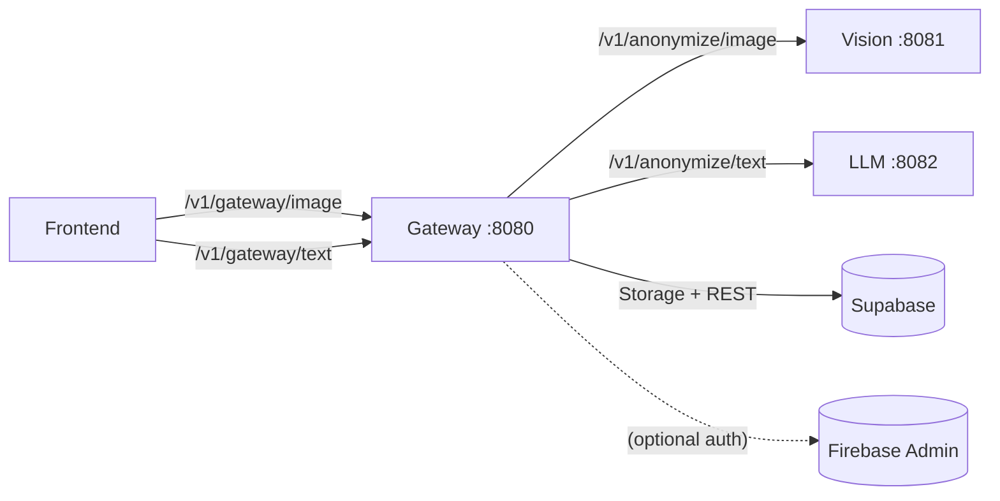

# PrismGuard - Vision Branch 

> This branch has **Vision** + **Gateway** wired up.
> Need to implement **`prismguard_llm`** (text redaction) and the **frontend**.

---

## Topology



---

## What’s already working

* **Vision service** (`prismguard-vision`) — blurs detected regions (YOLO).
* **Gateway** (`prismguard-gateway`) — single public entrypoint; uploads to Supabase; writes audit logs.
* **Python SDK** (optional) — minimal client for Gateway/Vision.
* **Supabase** — `audit_logs` table and Storage bucket.

---

## Env (.env at repo root), update .env.example and change to .env. remember to gitignore

```
# internal service URLs (docker network)
VISION_URL=http://prismguard-vision:8081
LLM_URL=                             # update once LLM is ready

# supabase
SUPABASE_URL=https://<project-ref>.supabase.co
SUPABASE_SERVICE_ROLE_KEY=eyJ...     # server-side ONLY
SUPABASE_BUCKET=prismguard-redacted  # exists already (right now i made it private)

# optional auth (production later)
# FIREBASE_ADMIN_CREDENTIALS_FILE=/app/firebase-admin-key.json
```

> If bucket is **private**, Gateway returns **signed** URLs. If **public**, returns public URLs.

---

## Run (local)

```bash
# Vision + Gateway
docker compose up -d --build prismguard-gateway
```

**Gateway response shape**

```json
{
  "redacted_image_b64": "iVBORw0K...", 
  "entities": [{"label":"object","conf":1.0,"bbox":[x1,y1,x2,y2]}],
  "timing_ms": 1234.5,
  "storage_url": "https://.../object/public|sign/...",
  "attestation": "v1"
}
```

---

## SDK (optional for convenience)

```bash
pip install -e ./sdk
python - <<'PY'
from prismguard_anonymizer import PrismGuard
pg = PrismGuard(gateway_url="http://localhost:8080", use_gateway=True)
r = pg.anonymize_image("prismguard_vision/test/test1.png", save_to="redacted.png")
print(r["entities"], r.get("storage_url"))
PY
```

---
## Minimal frontend demo

```
frontend/upload-demo.html
```

Serve locally:

```bash
cd frontend
python -m http.server 5500
# open http://localhost:5500/upload-demo.html
# or override: ?gateway=http://localhost:8080
```

The page POSTs to `POST /v1/gateway/image` and shows the redacted preview + link.

---

## Teammate Tasks

### 1) LLM service (`prismguard_llm`)

* Implement FastAPI (or similar) with:

  * `GET /health` → `{"ok": true}`
  * `POST /v1/anonymize/text`
    **Request**: `{"text":"...","mode":"smart"|"strict"}`
    **Response**:

    ```json
    {
      "redacted_text": "Your [REDACTED] prompt",
      "entities": [{"label":"PII","conf":0.98,"span":[start,end]}],
      "timing_ms": 45.6
    }
    ```
* Add service folder: `./prismguard_llm` (+ Dockerfile).
* Expose on `:8082`.
* Set `.env` → `LLM_URL=http://prismguard-llm:8082`.
* Compose will auto-wire Gateway → LLM.

### 2) Frontend

* Use the single upload API:

  * `POST {GATEWAY}/v1/gateway/image` (multipart: `file`)
* To enable auth later:

  * Obtain Firebase ID token and send `Authorization: Bearer <token>`.
* (Optional) Text redaction once LLM is ready:

  * `POST {GATEWAY}/v1/gateway/text` with `{"text":"...","mode":"smart"}`.

---

## Notes

* Supabase: `audit_logs` table already created; Gateway writes with **service role**.
* Orchestrator right **not required** for the current flow; we keep it out unless we need pipeline fan-out/rules.

---
