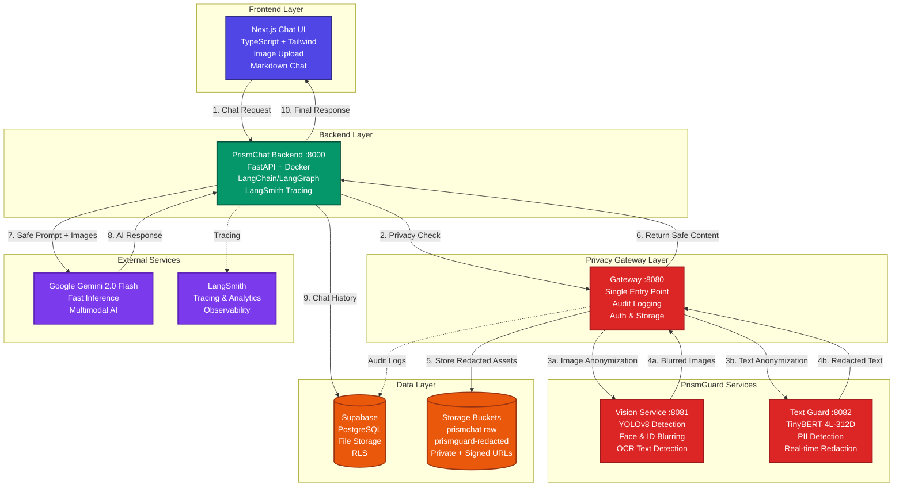

# 🛡️ PrismGuard

**Multi-Modal Privacy Firewall for the AI Era**

PrismGuard is a comprehensive privacy-first conversational AI platform that protects Personally Identifiable Information (PII) before it ever reaches external AI services. Think of it as a **VPN for your prompts and images** - everything passes through PrismGuard's privacy layers first.

Youtube Link for the Project Submission: https://youtu.be/a9anWGeS6T8 

---

## 🏗️ Complete System Architecture



---

## 🔄 Detailed Data Flow

### 1️⃣ User Interaction
```
User types: "Hi, I'm John Doe, my SSN is 123-45-6789"
User uploads: [ID_photo.jpg]
```

### 2️⃣ Frontend Processing
- **Next.js Chat UI** captures user input
- Sends `POST /v1/chat` to PrismChat Backend
- Includes: `conversation_id`, `text`, `images[]`, `prismguard: true`

### 3️⃣ Backend Orchestration
- **FastAPI Backend** receives request
- Routes through **LangChain/LangGraph** pipeline
- Forwards to **Gateway** for privacy processing

### 4️⃣ Privacy Gateway Processing
```
POST /v1/gateway/text
{
  "text": "Hi, I'm John Doe, my SSN is 123-45-6789",
  "mode": "strict"
}

POST /v1/gateway/image
multipart/form-data: file=ID_photo.jpg
```

### 5️⃣ Text Anonymization (TinyBERT 4L-312D)
```python
# Input Text Processing
original = "Hi, I'm John Doe, my SSN is 123-45-6789"

# Output
redacted = "Hi, I'm John Doe, my SSN is [REDACTED]"

```

### 6️⃣ Image Anonymization (YOLOv8 + OpenCV)
```python
# Vision Pipeline
1. YOLOv8 detects: faces, license plates, ID cards
2. OCR extracts: text regions, ID numbers, addresses  
3. OpenCV applies: Gaussian blur to detected regions
4. Result: Fully anonymized image

# Detected regions example
entities = [
  {"label": "face", "conf": 0.99, "bbox": [45, 23, 156, 134]},
  {"label": "id_text", "conf": 0.87, "bbox": [200, 300, 400, 350]}
]
```

### 7️⃣ Secure Storage
```
Original Image -> ❌ (Never stored)
Redacted Image -> ✅ Supabase Storage
Path: prismguard-redacted/{conversation_id}/image_uuid.png
Access: Private bucket with signed URLs (24h expiry)
```

### 8️⃣ AI Processing
```
# What Gemini receives:
text = "Hi, I'm [NAME], my SSN is [SSN]"
images = ["https://supabase.co/storage/sign/redacted_image.png?token=..."]

# What Gemini responds:
"Hello! I understand you've shared some personal information. 
I can help you with questions while keeping your privacy protected."
```

---

## 🛠️ Tech Stack Deep Dive

### Frontend Stack
```typescript
// Next.js 14 + TypeScript
- App Router for modern routing
- Tailwind CSS for styling  
- Marked + DOMPurify for safe Markdown
- Image optimization with next/image
- Real-time chat interface
```

### Backend Stack
```python
# FastAPI + Python Ecosystem
- LangChain: Prompt engineering & chains
- LangGraph: Stateful conversation flow
- LangSmith: Distributed tracing
- Supabase Python Client: Database & storage
- Google Gemini: Latest multimodal LLM
```

### Privacy Stack
```python
# PrismGuard Services
- TinyBERT 4L-312D: Fine-tuned on AI4Privacy dataset
- YOLOv8: Real-time object detection
- OpenCV: Image processing & blurring
- Tesseract OCR: Text extraction from images
- FastAPI: High-performance API services
```

---

## 🚀 Quick Start Guide

### Prerequisites
```bash
# Required
- Docker & Docker Compose
- Node.js 18+ 
- Supabase account
- Google AI API key
- LangSmith account (optional)
```

### 1️⃣ Environment Setup
```bash
# Clone repository
git clone https://github.com/your-org/prismguard
cd prismguard

# Copy environment template
cp .env.example .env

# Update .env with your keys
SUPABASE_URL=https://your-project.supabase.co
SUPABASE_SERVICE_ROLE_KEY=your-service-key
GOOGLE_API_KEY=your-gemini-key
LANGCHAIN_API_KEY=your-langsmith-key
```

### 2️⃣ Backend Services
```bash
# Start all privacy services
docker-compose up -d --build

# Services will be available at:
# - Gateway: http://localhost:8080
# - Vision: http://localhost:8081  
# - Text Guard: http://localhost:8082
# - PrismChat Backend: http://localhost:8000
```

### 3️⃣ Frontend
```bash
# Install and start Next.js
cd prismchatfrontend2/prismchat
npm install
npm run dev

# Frontend available at: http://localhost:3000
```

---

### Architecture Decisions
- **Microservices**: Independent scaling of privacy components
- **FastAPI**: High-performance async Python APIs
- **Supabase**: Postgres + Storage + Auth in one platform  
- **Docker**: Consistent deployment across environments
- **LangChain**: Standardized LLM orchestration

---

## 🙏 Acknowledgements

- **AI4Privacy Dataset**: Training data for PII detection
- **Hugging Face**: Transformer models and training infrastructure
- **LangChain Ecosystem**: LLM orchestration and tracing
- **Supabase**: Backend-as-a-Service platform
- **Google AI**: Gemini multimodal capabilities
- **Varun Gupta**: YOLOv8 model and dashcam anonymizer implementation ([dashcam_anonymizer](https://github.com/varungupta31/dashcam_anonymizer)) - our vision component builds upon this excellent work

---
**🛡️ PrismGuard - Privacy-First AI for Everyone**
